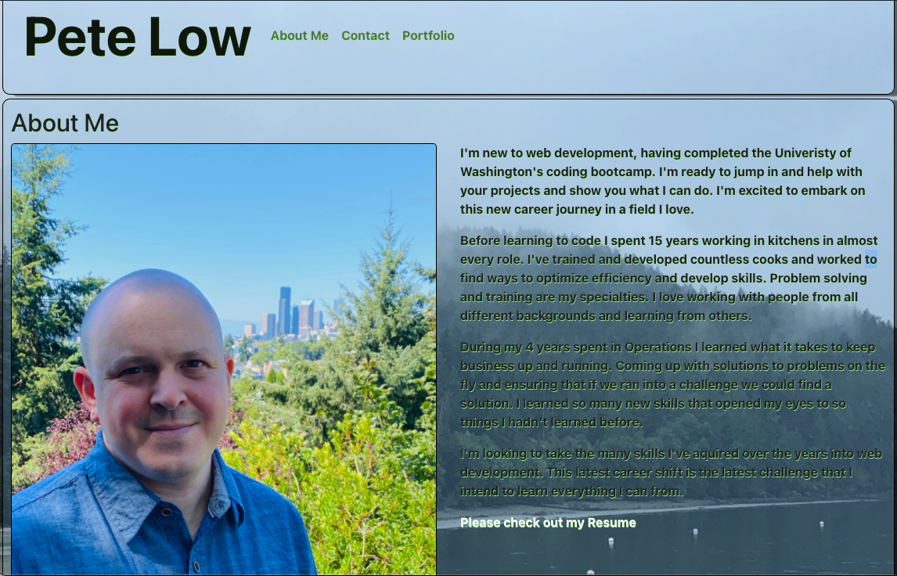
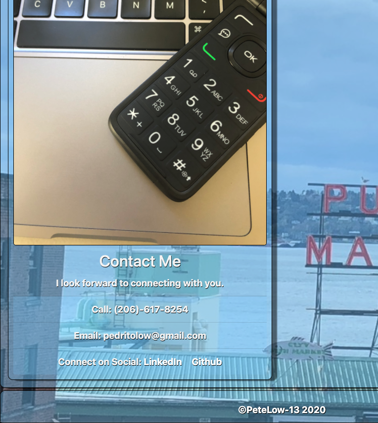

# PeteLow-React-Portfolio

## Description

My portfolio updated with React
## Table of Contents
- [Languages](#languages)
- [Repository](#repository)
- [Questions](#questions)

My portfolio updated with React

## Languages

React, Java Script, HTML, CSS

## Repository
- https://petelow-13.github.io/PeteLow-React-Portfolio/
## Questions

Contact me via email or github with questions
- pedritolow@gmail.com
- [PeteLow-13](http://github.com/PeteLow-13)