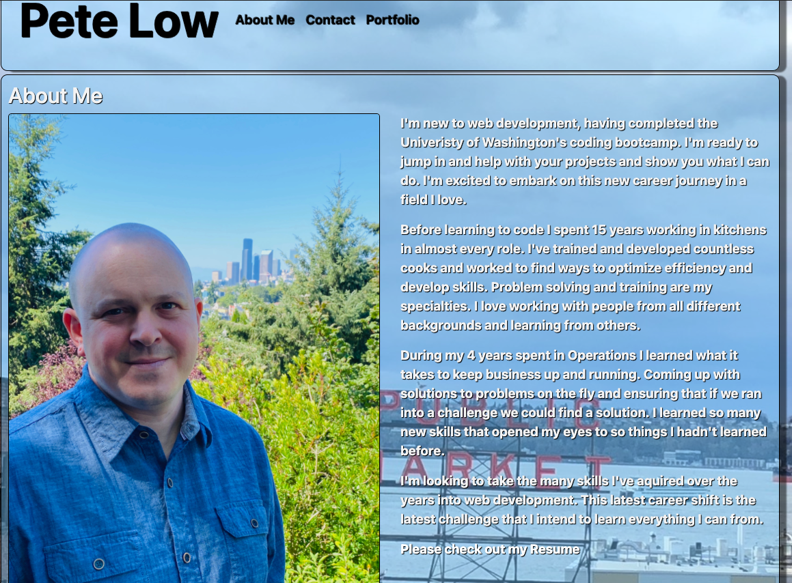

# PeteLow-React-Portfolio

## Description

My portfolio updated with React

## Table of Contents
- [Languages](#languages)
- [Deployed](#deployed)
- [Repository](#repository)
- [Questions](#questions)

## Languages

- [`ReactJS`](https://reactjs.org/)
- [`JSX`](https://reactjs.org/docs/introducing-jsx.html)
- [`Java Script`](https://www.javascript.com/)
- [`CSS`](https://en.wikipedia.org/wiki/CSS)
- [`NodeJS`](https://nodejs.org/en/)
## Deployed
- https://petelow-13.github.io/PeteLow-React-Portfolio/#/

## Repository
- https://petelow-13.github.io/PeteLow-React-Portfolio/
## Questions

Contact me via email or github with questions
- pedritolow@gmail.com
- [PeteLow-13](http://github.com/PeteLow-13)